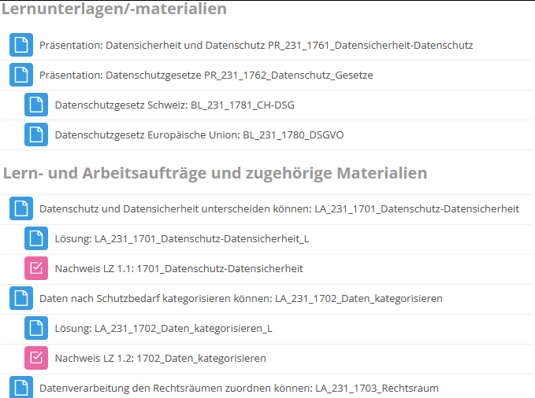
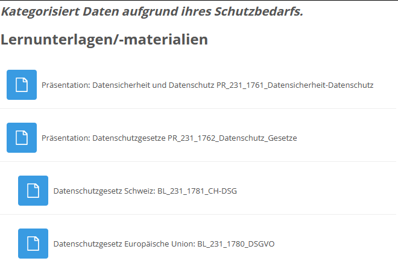

# CompactMoodle
This little Stylus script makes Moodle more compact.  
It mainly makes task symbols smaller but it also slightly tweaks headers.
| **New** | **Old** |
|----|----|
|  |  |

## Supported Themes  
- Lambda (Default for moodle.bbbaden.ch)
- Boost
- Classic  

It may work with other themes as well, just try it!  